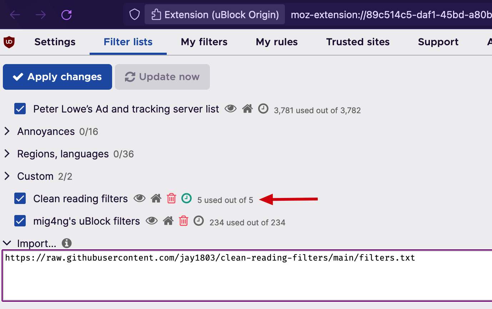
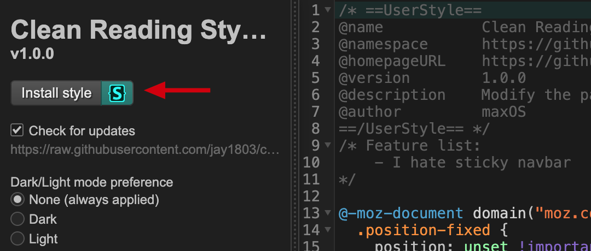

# Clean reading filters
This is a filter list for [uBlock Origin](https://github.com/gorhill/uBlock), to filter out irrelevant content from page. Such as recommond for you, page footer or navigation, only keep the main content for better reading experience.

You may wonder why not use reading mode or apps like Instapaper, the problem is some pages has unique layout, the reading mode and RIL(read it later) app didn't handle the layout properly. For example, in medium, there are some hightlights and comments I'd like to read as well. This filter will keep the origin website layout and design, but filter out the annoying elements.

The Stylus.user.css file is for [Stylus](https://github.com/openstyles/stylus), uBlock can modify the page css, but it didn't inject the css to page, when download the page with SingleFile, the modified style will be lost. That's why I need to use Stylus for this. For example, I hate sticky navigation, but I'd like to keep the navigation in page.

But I have to manually handle every website, yes, and I like to control the tools I'm using.

## Best practice

I use this filters and styles work with [SingleFile](https://github.com/gildas-lormeau/SingleFile), to download the webpage so I can read it later, literally offline reading. With this filters, the downloaded file size reduced 2-5x, save lots disk spaces.

## How to use
### Filters
1. Install [uBlock Origin](https://github.com/gorhill/uBlock)
2. In uBlock Origin settings > Filter lists tab, sroll down to the bottom of page
   you'll find the **Import...** section, paste `https://raw.githubusercontent.com/jay1803/clean-reading-filters/main/filters.txt` to the field then click **[Apply changes]** at the top left.
3. Then you'll saw the Clean reading filters appears in the Custom section.

### Stylus
1. Install [Stylus](https://github.com/openstyles/stylus)
2. Open this link [https://github.com/jay1803/clean-reading-filters/raw/main/stylus.user.css](https://github.com/jay1803/clean-reading-filters/raw/main/stylus.user.css), Stylus will auto detect and ask to install the style.

